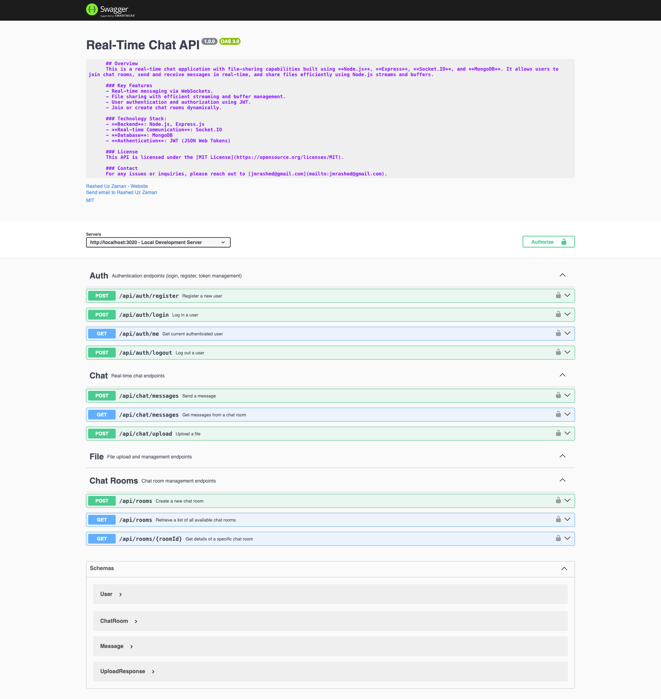

# Real-Time Chat Application (Server)

[](https://opensource.org/licenses/MIT)
[](https://nodejs.org/)
[](https://expressjs.com/)
[](https://socket.io/)
[](https://www.mongodb.com/)
[](https://mongoosejs.com/)
[](https://jwt.io/)
[](https://www.npmjs.com/package/bcrypt)
[](https://joi.dev/)
[](https://jestjs.io/)
[](https://www.docker.com/)
[](https://restfulapi.net/)
[](http://makeapullrequest.com)
[](https://github.com/jmrashed/chat-backend/stargazers)
[](https://github.com/jmrashed/chat-backend/network/members)

This is the server-side of a real-time chat application with file-sharing capabilities. Built using **Node.js**, **Express**, **Socket.IO**, and **MongoDB**, it allows users to join chat rooms, send/receive real-time messages, and share files using Node.js streams and buffers. User authentication, chat history, and file metadata are stored securely in MongoDB.

## Related Repositories

**Frontend Client**: For the complete chat application experience, you'll also need the frontend client. Check out the [Chat Frontend Repository](https://github.com/jmrashed/chat-frontend) which provides:
- Modern Next.js React interface
- Real-time UI updates
- Responsive design
- Optimized performance
- Socket.IO client integration

## Features

### Core Messaging
- **Real-time Communication**: Users can send and receive messages in real-time using Socket.IO
- **Message Reactions**: React to messages with emojis, real-time reaction updates
- **Message Editing/Deletion**: Edit sent messages and soft delete with permissions
- **Message Threads/Replies**: Reply to specific messages and create threaded conversations
- **Mentions**: @mention functionality with real-time notifications
- **Message Status**: Sent, delivered, and read status indicators
- **Typing Indicators**: Real-time "user is typing" notifications
- **Message Search**: Full-text search within chat history with pagination
- **Pinned Messages**: Pin important messages to chat rooms
- **Starred Messages**: Personal message bookmarking system

### File & Media
- **File Sharing**: Efficient file uploads/downloads with Node.js streams and buffers
- **File Metadata**: Store and retrieve file information with messages

### Authentication & Security
- **User Authentication**: Secure JWT-based login and registration
- **Permission System**: Role-based access control for message operations
- **Input Validation**: Comprehensive Joi-based validation
- **Rate Limiting**: Configurable rate limits for different endpoints

### Data & Performance
- **Persistent Storage**: MongoDB with optimized schemas and indexing
- **Real-time Updates**: Socket.IO events for all messaging features
- **Scalability**: Horizontal scaling support with concurrent user optimization
- **Comprehensive Testing**: 80%+ coverage with unit, integration, and performance tests

## Technologies Used

- **Node.js**: JavaScript runtime for building server-side logic
- **Express**: Fast web framework for Node.js with RESTful API design
- **Socket.IO**: Real-time, bidirectional communication with comprehensive event handling
- **MongoDB**: NoSQL database with optimized schemas for chat features
- **Mongoose**: ODM for MongoDB with advanced querying and population
- **JWT**: Secure user authentication using JSON Web Tokens
- **Joi**: Schema validation for all API endpoints
- **Bcrypt**: Password hashing and security
- **Multer**: File upload handling with stream processing
- **Jest**: Comprehensive testing framework

## Project Structure

```bash
.
├── .env.example
├── .gitignore
├── LICENSE
├── package.json
├── README.md
├── API.md
├── CHANGELOG.md
├── CONTRIBUTING.md
├── CODE_OF_CONDUCT.md
├── SECURITY.md
├── swagger.js
├── seeder.js
├── .github/
│   ├── ISSUE_TEMPLATE/
│   │   ├── bug_report.md
│   │   ├── feature_request.md
│   │   └── question.md
│   └── PULL_REQUEST_TEMPLATE.md
├── src/
│   ├── app.js
│   ├── config/
│   │   ├── database.js
│   │   ├── environment.js
│   │   ├── jwtConfig.js
│   │   └── socket.js
│   ├── controllers/
│   │   ├── authController.js
│   │   ├── chatController.js
│   │   ├── chatRoomController.js
│   │   └── fileController.js
│   ├── middleware/
│   │   ├── authMiddleware.js
│   │   ├── errorHandler.js
│   │   └── rateLimiter.js
│   ├── models/
│   │   ├── ChatRoom.js
│   │   ├── File.js
│   │   ├── Message.js
│   │   └── User.js
│   ├── routes/
│   │   ├── authRoutes.js
│   │   ├── chatRoomRoutes.js
│   │   └── chatRoutes.js
│   ├── services/
│   │   ├── authService.js
│   │   ├── chatService.js
│   │   ├── fileService.js
│   │   ├── messageService.js
│   │   └── socketService.js
│   ├── utils/
│   │   ├── fileUpload.js
│   │   ├── logger.js
│   │   └── responseFormatter.js
│   └── validations/
│       ├── auth.js
│       ├── chatRoom.js
│       ├── file.js
│       └── message.js
├── tests/
│   ├── auth.test.js
│   ├── chat.test.js
│   ├── chatRoom.test.js
│   ├── fileUpload.test.js
│   ├── integration.test.js
│   ├── message.test.js
│   └── performance.test.js
├── uploads/
└── views/
    ├── layouts/
    └── *.ejs
```
 

## Installation

### Prerequisites

- **Node.js** (version 14 or above)
- **MongoDB** (locally or cloud-hosted)
- **Docker** (optional, for containerized deployment)

### Step-by-Step Setup

1. **Clone the repository:**

    ```bash
    git clone https://github.com/jmrashed/chat-backend.git
    cd chat-backend
    ```

2. **Install dependencies:**

    ```bash
    npm install
    ```

3. **Create a `.env` file:**

    In the root of the project directory, create a `.env` file with the following content:

    ```env
    PORT=3000
    MONGODB_URI=mongodb://localhost:27017/realtime-chat-app
    JWT_SECRET=your_secret_key
    ```

4. **Start MongoDB:**

    Make sure MongoDB is running locally or connect to your cloud MongoDB instance.

    ```bash
    mongod
    ```

5. **Run the server:**

    Start the application with:

    ```bash
    npm start
    ```

6. **Access the Application:**

    Open your browser and navigate to `http://localhost:3000`.

## Running Tests

Comprehensive test suite covering unit, integration, and performance tests:

```bash
# Run all tests
npm test

# Run specific test suites
npm run test:unit          # Unit tests (auth, chat rooms, messages, files)
npm run test:integration   # Integration tests (full API flows)
npm run test:performance   # Performance tests (load testing)
npm run test:coverage      # Generate coverage report
npm run test:watch         # Watch mode for development
```

## Docker Setup

To run the server in a Docker container:

1. **Build the Docker image:**

    ```bash
    docker build -t realtime-chat-app-server .
    ```

2. **Run the Docker container:**

    ```bash
    docker run -d -p 3000:3000 realtime-chat-app-server
    ```

3. **Access the Application:**

    Navigate to `http://localhost:3000` to use the chat application.

## API Documentation

For API documentation, you can explore the endpoints through Postman or Swagger:

- **Postman Documentation**: [Postman Collection](your-postman-link)
- **Swagger UI**: Available locally at `/api-docs` after starting the server.

## Scalability and Optimization

- **Horizontal Scaling**: Cluster the app or use multiple instances behind a load balancer.
- **Redis**: Use Redis to handle session management and WebSocket scaling with Socket.IO.
- **Database Indexing**: Ensure MongoDB collections are indexed for optimal query performance.
- **Rate Limiting**: Implement rate limiting to control API usage and prevent server overload.

## Quality Assurance

### Error Handling
Robust error handling throughout the application:
- Invalid JWT tokens and authentication failures
- Database connection and query errors
- File upload/download issues and validation
- Input validation with detailed error messages
- Consistent error response format

### Testing
- **Unit Tests**: Individual component testing (auth, rooms, messages, files)
- **Integration Tests**: Full API workflow testing
- **Performance Tests**: Load testing and concurrent user simulation
- **Coverage**: 80%+ test coverage with detailed reports

### Security
- Rate limiting on all endpoints (configurable per endpoint type)
- Input validation and sanitization
- File type and size restrictions
- Environment-specific CORS configuration
- Secure password hashing with bcrypt

### Code Quality
- JSDoc documentation for all functions
- Consistent error handling patterns
- Environment-specific configurations
- Clean, maintainable code structure

## API Endpoints

### Messages
- `POST /api/chat/messages` - Send message with optional reply/mentions
- `GET /api/chat/messages/:room` - Get messages with pagination
- `PUT /api/chat/messages/:id` - Edit message (owner only)
- `DELETE /api/chat/messages/:id` - Soft delete message (owner only)
- `GET /api/chat/messages/search` - Search messages with filters

### Reactions
- `POST /api/chat/messages/:id/react` - Add emoji reaction
- `DELETE /api/chat/messages/:id/react/:reactionId` - Remove reaction

### Message Status
- `PUT /api/chat/messages/:id/read` - Mark message as read
- `PUT /api/chat/messages/:id/pin` - Pin/unpin message

### Favorites
- `POST /api/chat/favorites` - Add message to favorites
- `DELETE /api/chat/favorites/:messageId` - Remove from favorites
- `GET /api/chat/favorites` - Get user's favorite messages

### Socket Events
- `sendMessage`, `receiveMessage`, `receiveReply`
- `addReaction`, `removeReaction`, `reactionAdded`, `reactionRemoved`
- `editMessage`, `deleteMessage`, `messageEdited`, `messageDeleted`
- `markAsRead`, `messageRead`, `messageDelivered`
- `typingStart`, `typingStop`, `userTyping`, `userStoppedTyping`
- `pinMessage`, `messagePinned`, `messageUnpinned`
- `mention` - Real-time mention notifications

## Future Improvements

- **Push Notifications**: Mobile and web push notifications for mentions
- **Voice Messages**: Audio message recording and playback
- **Message Encryption**: End-to-end encryption for sensitive conversations
- **Advanced Search**: Search by date range, file type, user, etc.
- **Message Templates**: Quick reply templates and saved responses
- **Admin Dashboard**: Comprehensive admin panel for user and content management

## License

This project is licensed under the [MIT License](LICENSE). 


 ## Screenshots

Here are some screenshots of the project:

### Screenshot 1


## 👨💻 Author

**Md Rasheduzzaman**  
Full-Stack Software Engineer & Technical Project Manager  

Building scalable, secure & AI-powered SaaS platforms across ERP, HRMS, CRM, LMS, and E-commerce domains.  
Over 10 years of experience leading full-stack teams, cloud infrastructure, and enterprise-grade software delivery.

**🌐 Portfolio:** [jmrashed.github.io](https://jmrashed.github.io/)  
**✉️ Email:** [jmrashed@gmail.com](mailto:jmrashed@gmail.com)  
**💼 LinkedIn:** [linkedin.com/in/jmrashed](https://www.linkedin.com/in/jmrashed/)  
**📝 Blog:** [medium.com/@jmrashed](https://medium.com/@jmrashed)  
**💻 GitHub:** [github.com/jmrashed](https://github.com/jmrashed)

---

> *"Need a Reliable Software Partner? I build scalable, secure & modern solutions for startups and enterprises."*